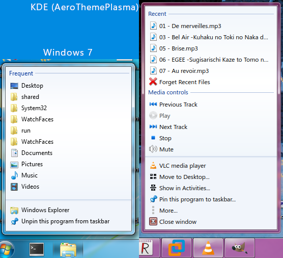

# SEVENTASKS

## TABLE OF CONTENTS
1. [Detailed description](#description)
    1. [Hot tracking](#hottracking) 
    2. [Context menu](#contextmenu)
3. [File structure](#files)
4. [File details](#details)

## Detailed description <a name="description"></a>

Under KDE Plasma, a task manager is any plasmoid that shows a list of windows (tasks) that are rendered by the window manager. A task manager also handles things like grouping tasks together, allowing the user to see a preview of any window, controlling tasks and many other things. SevenTasks forks the default task manager, while adding significant visual and functional changes. 

The default task manager from KDE comes in two different variants: regular and icons-only. If the user decided to switch between the two, they would have to replace the plasmoid completely with the other variant. SevenTasks merges both plasmoids together, and instead makes showing labels an option that can be toggled in the settings.

While most of these changes were possible to implement in pure QML, some effects couldn't have been implemented without adding an additional layer of complexity in the form of a compiled C++ part.

### Hot tracking

Under Windows 7, 8 and 8.1, tasks featured a visual effect known as "Hot tracking", where upon hovering over a task, a glowing light would appear that would follow the mouse horizontally (or vertically if the taskbar is oriented vertically). Additionally, a subtle glowing border would also appear around the hovered task. 

Both of these effects share the same color, and that color is determined by the "dominant" color of the task icon. Interestingly enough, the algorithm that calculates the dominant color of an icon seems to be different between Windows 7 and 8/8.1, and as the source code and implementation details aren't public, SevenTasks has its own implementation that tries to be  faithful to Windows 7's implementation, but sometimes comes up with different results. 

The details regarding the general algorithm can be found [here](https://superuser.com/questions/730804/how-does-windows-7-calculate-the-color-to-use-for-taskbar-color-hot-tracking), and the following algorithm is implemented by SevenTasks:

1. We define the default highlight color as rgb(55, 176, 255). ( <span style="background-color: #37b0ff;">&nbsp;&nbsp;&nbsp;&nbsp;&nbsp;</span> )
2. If the icon doesn't exist (null), the icon is replaced with the icon associated with 'exec'. 
3. We define a histogram, which is just a 3x3x3 list of colors, we can think of this as 27 neatly ordered buckets which represent a certain range of colors.
4. For the given icon, iteratively find the closest icon size that matches 32x32 pixels, going up in size with each unsuccessful iteration. 32x32 was chosen as the base resolution as most icons have it and it's a nice balance between accuracy and performance.
5. For every pixel in the icon, the color is separated into its red, green and blue components. 
6. Every color component is then transformed into indexes in the range [0, 2]. Values within the range [0,60) return 0, [60, 200) return 1, and [200, 255] return 2.
7. If all three indexes are the same value after transformation, the pixel isn't added to any bucket. Otherwise, add the pixel to the bucket at the calculated indexes.
8. Find the bucket with the highest number of pixels. If the indexes of the bucket are all equal, discard it and return the default highlight color.
9. Iterate through the bucket and calculate a "minimum" and "maximum" color. The minimum/maximum color is formed by finding the minimum/maximum of each color component independently.
10. Calculate an average color by averaging the minimum and maximum color together (Averaging their color components respectively). 
11. If the average color's HSV saturation is less than 32, return the default highlight color.
12. If the average color's HSV value is less than 85, return the default highlight color.
13. Multiply the saturation and value of the average color by 1.5 (clamping it into range [0, 255]), return the resulting color with an alpha value of 200. 

Here are some examples, comparing Windows 7 (top) with SevenTasks (bottom):


### Context menu

SevenTasks features a complete reimplementation of the context menu found in Vista, 7, and 8/8.1, while retaining KDE specific features. 



Internally, the new context menu is based on PlasmaCore.Dialog, with the solid visual appearance. As it is meant to act as a context menu, it needs to fulfill the following criteria:

- The context menu grabs *all* mouse and key inputs.
- The context menu must disappear if an event outside of it causes it to lose focus.
- The context menu must disappear if a menu item has been activated either with the mouse or the keyboard.
- The context menu must disappear if the user clicks away from it or the Escape key is pressed on the keyboard.

The current implementation accomplishes all of these except for grabbing all inputs from the keyboard, as that isn't necessary for the context menu to work properly. As such, the context menu is more forgiving when it comes to performing actions such as pressing global keyboard shortcuts. Note that this only applies when the main context menu is in focus, as child context menus are just regular Qt context menus which do grab every kind of input.

Additional notes:

- Getting the dialog window to grab mouse events will only work when either no mouse event is currently being handled, or if there is, it has to be the released or clicked event.
- The code makes a few redundant function calls to ensure the context menu really does grab the mouse, most notably with a timer that runs shortly after the context menu is shown. 
- Despite the context menu being initialized, most of its visual properties are not well behaved until the visible property is set to true. Most notably, the x position may sometimes be reset to 0. As such, the code makes a few redundant calls in order to correctly set the x position and ensure it isn't reset. 
- Certain actions (unpinning, closing tasks, activities) are delayed in order to prevent the context menu from being immediately removed, instead letting the menu fade out as it is freed from memory gracefully.
- Blur behind the window is only active once all animations are finished and the context menu is fully visible. 
- PlasmaComponents.MenuItem elements are not renderable or interactable outside of PlasmaComponents.ContextMenu. As such, menu items visible in the context menu are made from a wrapper item, which consists of the PlasmaComponents.MenuItem and a child TasksMenuItem which does the actual rendering. 
- The original ContextMenu file is still available in the source code, and can still be activated by commenting out and editing the necessary code. The regular context menu is deprecated, and will be removed in the future. (TODO)

## File structure <a name="files"></a>

This section lists the locations of modified files and a short description of their roles.
<br>

|Name                      |Location          |Description                                                        |
|--------------------------|------------------|-------------------------------------------------------------------|
|seventasks.cpp    |src/                        |Implementation of the dominant color algorithm.|
|seventasks.h      |src/                        |Header file of the C++ source file.|
|main.xml          |src/package/contents/config/|Contains the default settings for the plasmoid configuration.|
|ConfigBehavior.qml|src/package/contents/ui/    |Defines the plasmoid settings' graphical interface.|
|main.qml          |src/package/contents/ui/    |The main file of the plasmoid.|
|Task.qml|src/package/contents/ui/    |The base task item.|
|TasksMenu.qml|src/package/contents/ui/|Reimplemented context menu.|
|TasksMenuItem.qml|src/package/contents/ui/|Renderable and interactable part of the context menu item.|
|TasksMenuItemSeparator.qml|src/package/contents/ui/|Separator items for the context menu.|
|TasksMenuItemWrapper.qml|src/package/contents/ui/|PlasmaComponents.MenuItem with an embedded TasksMenuItem element and shortcut component.|
|ToolTipDelegate.qml|src/package/contents/ui/    |An item that strings together grouped task previews.|
|ToolTipInstance.qml|src/package/contents/ui/    |A single instance of a task preview.|
|ToolTipWindowMouseArea.qml|src/package/contents/ui/|Highlight that appears on a task preview.|


## File details <a name="details"></a>

### main.xml & ConfigBehavior.qml

Plasmoids with settings make use of the main.xml file to define entries and their default values. Entries are categorized into groups, and each entry has a name and type attribute. Some basic types include: 

- Bool 
- Enum
- Int
- String
- StringList
- Url

While entries can include other additional elements, most of them include a label and default tag. A label describes what the settings entry is for, while the default tag defines the default value for the entry. 

SevenTasks adds the following entry to the settings:

```
<entry name="labelVisible" type="Bool">
      <label>Show labels next to task icons.</label>
      <default>false</default>
</entry>
```

Every entry needs a matching control to be defined in QML. In ConfigBehavior.qml, the following is added for toggling this entry:

```
//...
property alias cfg_labelVisible: labelVisible.checked
//...
CheckBox {
    id: labelVisible
    Kirigami.FormData.label: i18n("Labels:")
    text: i18n("Show labels next to task icons")
}
```

### seventasks.h & seventasks.cpp

Public methods:
<br>

|Type|Name|Description|
|------|------------------------------|-----------|
|void|disableBlurBehind(QWindow*)|Disables the blur behind a window. Used to make the fade out effect of the context menu closing more visually pleasing.|
|QColor|getDominantColor(QVariant src)|Returns the dominant color of the icon. Even though the argument a QVariant, the expected data type is QIcon.|
|QPoint|getPosition(QWindow*)|Gets the local mouse coordinates with respect to the QWindow.|
|bool|isActiveWindow(int wid)|Returns if the window identified by the provided wId is active.|
|void|setMouseGrab(bool arg, QWindow* w)|Makes a QWindow object grab all mouse events from the system. Additionally installs the singleton Applet class to the provided QWindow object as an event filter. More details are in the source code.|


Protected methods:
<br>

|Type|Name|Description|
|----|----|-----------|
|bool|eventFilter(QObject* watched, QEvent\* event)|Filters mouse click events in order to notify the context menu that the mouse has been clicked.|

Signals:
<br>

|Name|Description|
|----|-----------|
|mouseEventDetected()|This signal is emitted when the event filter detects a mouse click event.|

Functions:
<br>

|Type|Name|Description|
|----|----|-----------|
|QRgb|averageColor(QRgb a, QRgb b)|Mixes the two provided colors by doing an average of every color component.|
|unsigned int|mapColorChannel(int channel)|Transforms the provided integer from the range [0,255] to [0,2] according to the algorithm described above.|
|unsigned char|max(unsigned char a, unsigned char b)|Returns the maximum between the two arguments.|
|unsigned char|min(unsigned char a, unsigned char b)|Returns the minimum between the two arguments.|
