# SEVEN-BLACK KDE PLASMA THEME

## TABLE OF CONTENTS

1. [Detailed description](#description)
2. [File structure](#files)
3. [Nonstandard SVGs](#svgs)

## Detailed description <a name="description"></a>

Seven-Black is the theme for KDE Plasma's shell, responsible for defining the appearance of panels, plasmoids, dialog windows, tooltips, etc. This includes almost all components written in QML that make use of KDE's API (PlasmaComponents, PlasmaExtras).

KDE Plasma styles consist of SVG files which define the appearance of shell components and basic graphical elements. The program **Plasma Theme Explorer** can be used to examine the theme and to get a description of where each SVG file is used. The color scheme of the style can also be examined. A more detailed explanation on Plasma styles can be seen [here](https://develop.kde.org/docs/plasma/theme/theme-details/). More documentation about KDE Plasma in general can be seen [here](https://develop.kde.org/docs/plasma/).

Windows following Plasma's API can have three general appearances depending on certain system settings:

1. Default - Compositing is enabled and background contrast is disabled
2. Transparent - Compositing is enabled and background contrast is enabled
3. Opaque - Compositing is disabled, background contrast doesn't matter here

KDE Plasma will read different SVG files depending on which appearance is currently active. This theme completely ignores the transparent appearance state, so it's recommended to keep the background contrast setting off.

### Solid appearance

The solid appearance is a fourth appearance state that doesn't depend on how the system is configured, instead it is used on demand by plasmoids. Going by KDE's official documentation, this appearance state should be used for completely opaque elements, and in practice, most other themes don't include any kind of dedicated SVG here, simply letting Plasma render solid elements with a single color.

However, compositing effects are still applied to these elements, and more importantly, any SVG file can be provided for the solid appearance state, regardless if the texture is detailed, transparent or opaque. This theme takes advantage of that at the cost of using this state in an unintended, nonstandard way. Being a relatively rare method of rendering things, it's considered a worthy tradeoff.

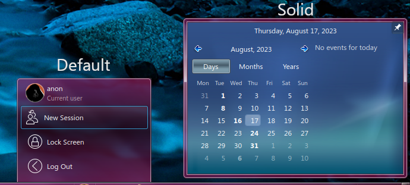

This project uses solid textures for the system tray, as well as DigitalClockLite. The design of the solid panel texture is meant to replicate the floating panels from the system tray as seen in Windows 7. However, due to certain limitations in the way Plasma handles theming, the text in these dialog windows cannot be drawn with a black color (or at least, definitely not easily), hence why a stylized blue background has been placed instead, to provide readability while keeping in line with Aero's aesthetics.

Regular textures are used for all other windows (plasmoids, OSD popups, task switchers, side menus and notification popups).

The opaque appearance state aims to be a recreation of Aero Basic (WIP). Currently, only plasmoids using solid textures and the window manager don't comply with the aesthetic, but everything else does. A potential solution is to detect a change in compositing in plasmoids that use solid textures, change the dialog type to ```NoBackground``` and display a custom texture as the background while compositing is disabled. A similar solution can also be applied to the window manager.

### Icons

This theme also features a small set of icons used mainly by plasmoids like the system tray. Most of these icons are simply just scaled down variants of icons taken from Breeze, while other icons are taken directly from the main icon theme of this project.

Following the release of KDE Plasma 6, this part of the Plasma theme will become deprecated.

## File structure <a name="files"></a>

This section will focus on files that are affected by the colorization effect, files that represent the Aero Basic style, as well as files that are used only by this project. It should be noted that these nonstandard files are now decoupled from Seven-Black and are located in their respective plasmoids' source code, so that they can be used without having to rely on this specific Plasma style. As such, these nonstandard files will be removed completely from Seven-Black in future releases.

The "Unique" column describes if the file itself is exclusive to Seven-Black.

<br>

|Name                  |Location       |Description                                         |Has accent color|Standard|Unique|
|----------------------|---------------|----------------------------------------------------|----------------|--------|------|
|background.svg        |dialogs/       |Default dialog texture.                             |Y               |Y       |N     |
|panel-background.svg  |widgets/       |Default taskbar texture.                            |Y               |Y       |N     |
|tooltip.svg           |widgets/       |Default tooltip texture.                            |Y               |Y       |N     |
|button-close.svg      |widgets/       |Close button icon used in SevenTasks.               |N               |N       |Y     |
|menuitem.svg          |widgets/       |Texture used for menu items in SevenStart and SevenTasks|N               |N       |Y     |
|showdesktop.svg       |widgets/       |Texture used for the Show desktop plasmoid.         |N               |N       |Y     |
|sidebaritem.svg       |widgets/       |Texture used for sidebar entries in SevenStart.     |N               |N       |Y     |
|startmenu-buttons.svg |widgets/       |Texture used for the shut down button in SevenStart.|N               |N       |Y     |
|system-lock-screen.svg|widgets/       |Lock icon used in SevenStart.                       |N               |N       |Y     |
|systray.svgs          |widgets/       |Texture used for the expander arrow button in the system tray.|N     |N       |Y     |
|taskbarhover.svg      |widgets/       |Texture used for hovered tooltips in SevenTasks.    |N               |N       |Y     |
|arrows.svgz           |widgets/       |Used mainly by SevenStart and the system tray.      |N               |N       |N     |
|button.svg            |widgets/       |Used by the keyboard layout switcher plasmoid.      |N               |N       |N     |
|tabbar.svgz           |widgets/       |Used mainly by SevenTasks and the system tray.      |N               |N       |N     |
|tasks.svg             |widgets/       |Used by SevenTasks for custom grouped tasks.        |N               |N       |N     |
|viewitem.svgs         |widgets/       |Used by the desktop containment.                    |N               |N       |N     |
|background.svg        |opaque/dialogs/|Used when compositing is disabled.                  |N               |Y       |N     |
|panel-background.svg  |opaque/widgets/|Used when compositing is disabled.                  |N               |Y       |N     |
|tooltip.svg           |opaque/widgets/|Used when compositing is disabled.                  |N               |Y       |N     |
|background.svg        |solid/dialogs/ |Used by the system tray and date and time plasmoid. |Y               |Y       |N     |

## Nonstandard SVGs <a name="svgs"></a>

This section will go through every nonstandard SVG file used by various plasmoids featured by AeroThemePlasma. As these files have now been relocated, for every file listed here there will be a list of plasmoids from this project that use the file.

### system-lock-screen.svg

Used in: SevenStart (io.gitgud.wackyideas.SevenStart)

Used for displaying the lock button next to the Shut Down button. The SVG itself has two elements - "dark-lock" and "light-lock", so that SevenStart can toggle between them as the user enters or exits the search view.

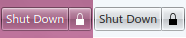

### button-close.svg

Used in: SevenTasks  (io.gitgud.wackyideas.seventasks)

It has three prefix states:

- Default (no prefix)
- Hovered (hover-)
- Pressed (pressed-)

Used in the tooltip popup when a task is hovered over with the mouse.

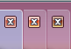 

### showdesktop.svg

Used in: Show Desktop (Aero) (io.gitgud.wackyideas.win7showdesktop)

It has three prefix states:

- Normal (normal-)
- Hovered (hover-)
- Selected (selected-)

Used to give the button a scalable texture.

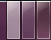 

### sidebaritem.svg

Used in: SevenStart (io.gitgud.wackyideas.SevenStart)

It doesn't have any states other than the default, as it is only visible when hovered over or focused during keyboard navigation. It is used in SevenStart as a texture for the sidebar menu entires.

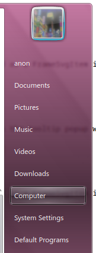 

### startmenu-buttons.svg

Used in: SevenStart (io.gitgud.wackyideas.SevenStart)

This is a set of two 9 segment textures used as FrameSvgItems. Both textures have the following states, with the right-oriented button additionally having a ```rtl-``` prefix:

- Normal (normal-)
- Hovered (hover-)
- Pressed (pressed-)

Used for the shut down and lock screen buttons.

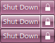 

### taskbarhover.svg

Used in: SevenTasks (io.gitgud.wackyideas.seventasks)

It has two states:

- Normal (normal-)
- Active (active-)

It is used as a tooltip hover indicator. It will appear in its active state when the task's window is active. Otherwise, the tooltip is in its normal state and invisible by default. The texture is rendered with different opacities, depending on the mouse state (hovered and clicked states).

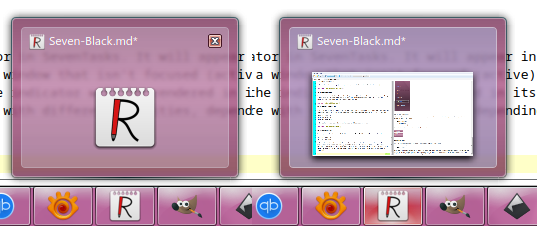 

### arrows.svgz

Used in: SevenStart (io.gitgud.wackyideas.SevenStart)

Apart from the standard four oriented arrows, two variants have been added:

- Hovered (with a hover- prefix)
- Black (with a -black suffix)

Used in the application view and in other minor graphical elements.

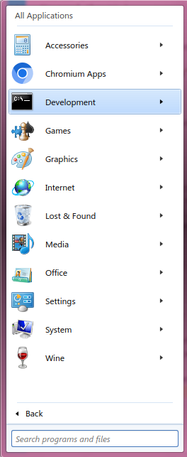 

### button.svg

Used in: Keyboard Layout (org.kde.plasma.keyboardlayout)

A 9 segment button texture has been added with two states:

- Hover (keyboard-hover-)
- Pressed (keyboard-pressed-)

Used to give the layout switcher a button appearance.

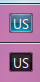 

### tabbar.svgz

Used in: SevenTasks (io.gitgud.wackyideas.seventasks), DigitalClockLite (io.gitgud.wackyideas.digitalclocklite)

This SVG contains 9 segment textures with three states:

- Active (active-)
- Pressed (pressed-)
- North active (north-active-)

The north active state is typically used for actual tabs, which is why it has a distinct look from the other two states. The regular active state is used when the user hovers over an element.

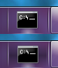 
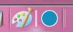 

### tasks.svg

Used in: SevenTasks (io.gitgud.wackyideas.seventasks)

The biggest modification to this SVG file is the addition of a stacked modifier to each state, defined with the "stacked+" suffix. These are mostly blank 9 segment textures with the right borders kept visible. Used for grouping multiple tasks together, achieving a graphical effect of "stacking" multiple elements on top of each other.

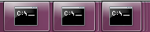 

### viewitem.svg

Used in: Desktop containment (org.kde.desktopcontainment)

It has three states:

- Hover (hover-)
- Selected (selected-)
- Selected+Hover (selected+hover-)

Used for signifying the highlight and selected state for icons on the desktop.

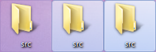

### menuitem.svg

Used in: SevenStart (io.gitgud.wackyideas.SevenStart), SevenTasks (io.gitgud.wackyideas.seventasks)

It has three states:

- Hover (hover-)
- Selected (selected-)
- Selected+Hover (selected+hover-)

Used for all menu items in the start menu, as well as menu items in the context menu for SevenTasks.

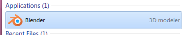

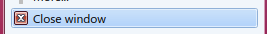
