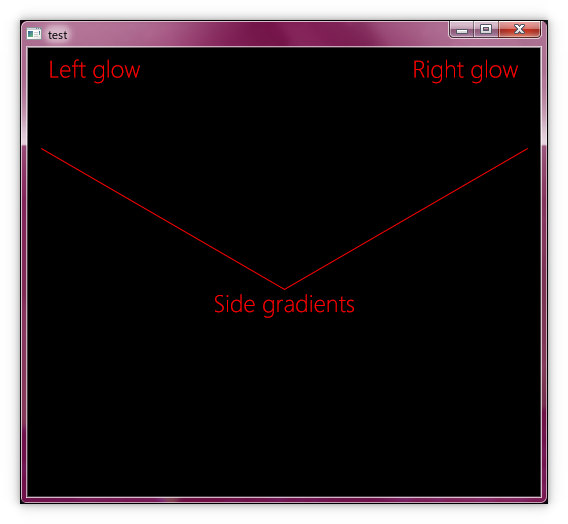
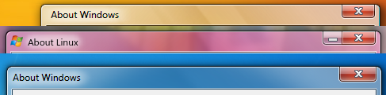

# SMARAGD SEVEN WINDOW DECORATION THEME

## TABLE OF CONTENTS

1. [Detailed description](#description)
2. [Theme configuration](#theme)
3. [File structure](#files)

## Detailed description <a name="description"></a>

This is the theme component of Smaragd Seven based on Emerald, the window decorator for Compiz. For a basic introduction on Emerald in the context of Compiz and regular Smaragd, click [here](http://wiki.compiz.org/Decorators/Emerald).

Despite the use of non-standard textures, this theme is still compatible with regular Compiz, which just ignores the files specific to Smaragd Seven. When used with Smaragd Seven, the theme provides additional textures for the following elements: 

- Side gradients
- Left side glow
- Right side glow



One element that is rendered by Smaragd Seven independently of the Emerald theme is the glowing effect behind the text of the window. Changing settings related to this effect in the theme configuration file will not alter its behavior. It should also be pointed out that reflections are not rendered by Smaragd Seven, but rather the Reflection KWin effect.

One notable difference compared to the default Windows 7 look is that the titlebar height and window buttons are sized differently. The sizing has been set to look more like Windows Vista's default settings instead. (Top - Vista, Bottom - 7)



One last important detail is that the window decoration itself is fully transparent. Instead, the decoration is colored by the reflection effect, while Smaragd Seven provides the transparent texture that is rendered on top of the reflections.

## Theme configuration <a name="theme"></a>

Certain details about the theme are dictated by the `theme.ini` configuration file. It's not recommended to edit this file, either manually or through the Emerald Theme Manager, as most values don't have an effect anymore when using Smaragd Seven, some are configured with non-standard values, and most other values are already configured to achieve this specific look. Some relevant settings include:

```
[engine]
# Tells the decorator to use the vrunner engine for rendering the window decoration texture. 
engine=vrunner 

[vrunner_settings]
...
# Windows will have rounded corners with the radius of 6 pixels. 
radius=6 

[buttons]
...
# Caption buttons will be offset by 2 pixels to the right, to align them with
# the right window border. Negative values here are not supported, as opening up Emerald Theme Manager
# will simply reset this value back to 0, not allowing negative values. 
horizontal_offset=-2

[titlebar]
min_titlebar_height=21
# This defines the standard item layout for the titlebar (Icon, window title, minimize, maximize and close)
title_object_layout=I(2)T::NXC:Normal Layout
```

## File structure <a name="files"></a>

|Name                     |Description                                                                    |Standard|
|-------------------------|-------------------------------------------------------------------------------|--------|
|buttons.close.png        |Contains textures for the close button for both active and inactive windows.   |Y       |
|buttons.glow.png         |Contains glow textures for all the buttons when the window is active.          |Y       |
|buttons.inactive_glow.png|Contains glow textures for all the buttons when the window is inactive.        |Y       |
|buttons.max.png          |Contains textures for the maximize button for both active and inactive windows.|Y       |
|buttons.min.png          |Contains textures for the minimize button for both active and inactive windows.|Y       |
|buttons.restore.png      |Contains textures for the restore button for both active and inactive windows. |Y       |
|reflection.png           |The default reflection texture for the Reflection KWin effect.                 |N       |
|sidebar.png              |Texture for the side border gradients when the window is active.               |N       |
|sidebar_unfocus.png      |Texture for the side border gradients when the window is inactive.             |N       |
|sideglow_left.png        |Texture for the left side glow effect of the window.                           |N       |
|sideglow_right.png       |Texture for the right side glow effect of the window.                          |N       | 


