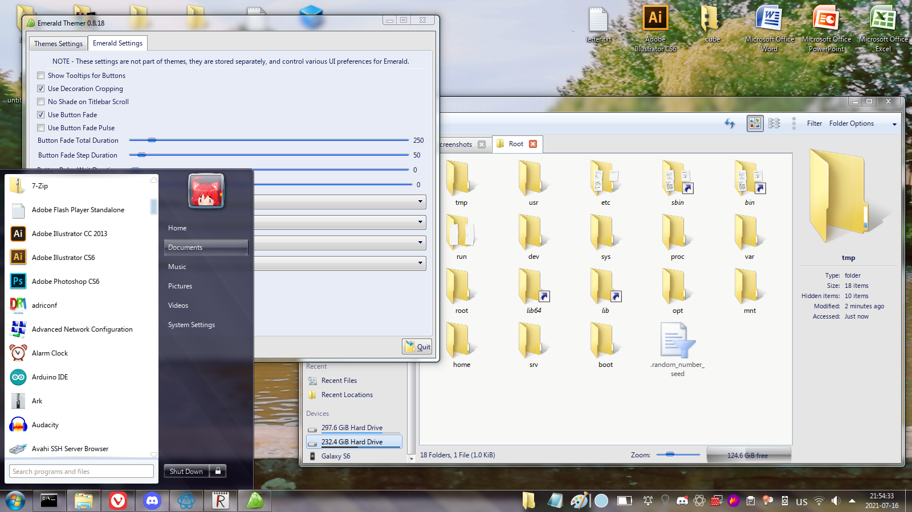
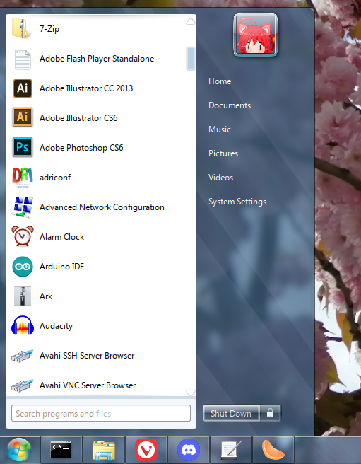
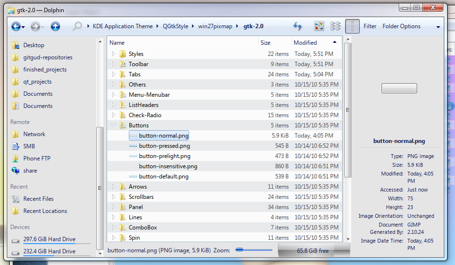
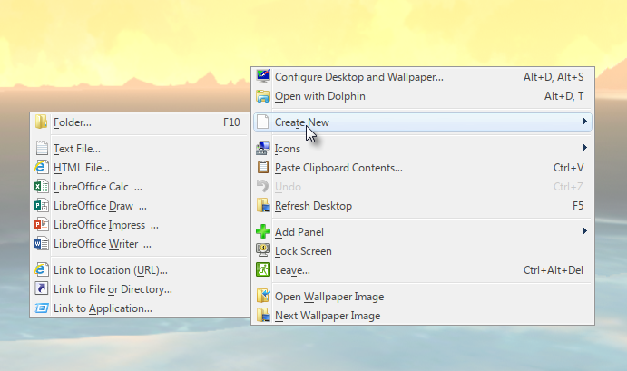
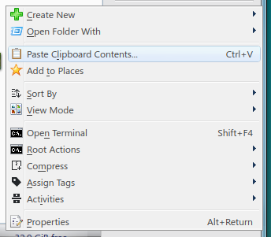
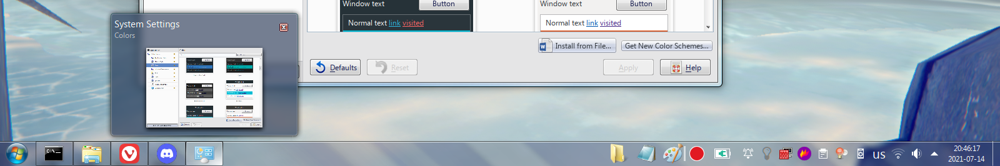
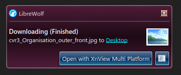
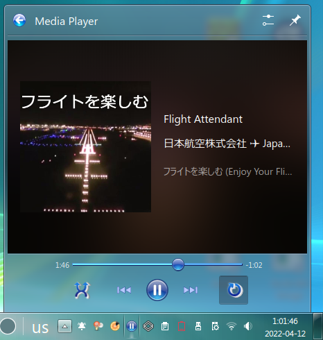
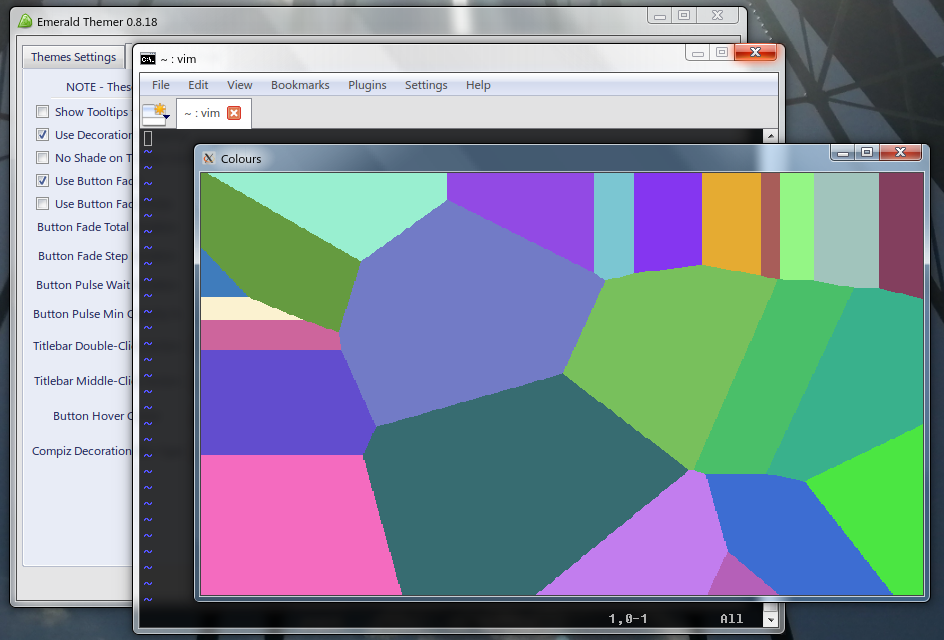

# AERO THEME FOR KDE VERSION 1.2

## Donate

BTC: bc1qfs0w6xstcgkjggu9e7gqucrpqvshwfj73h4d4t

## Credits

1. [Seven-Black](https://www.kde-look.org/p/998614)
2. [Win2-7(Pixmap)](https://www.opendesktop.org/p/1014539)
3. [Win2-7](https://www.gnome-look.org/p/1012465)
4. [Seven Black Aurorae](https://store.kde.org/p/1002615)
5. [Smaragd](https://www.pling.com/p/1167274)
6. [Aero for Emerald](https://store.kde.org/p/1003826/)
7. [Windows 7 GTK3 Theme](https://b00merang.weebly.com/windows-7.html)
8. [Avalon Menu](https://store.kde.org/p/1386465/)
9. [Digital Clock Lite](https://www.kde-look.org/p/1225135/)
10. [Show Desktop (Win7)](https://www.kde-look.org/p/1100895/)
11. [Equilibrium GTK3](https://store.kde.org/p/1493643/)
12. [Aero Mouse Cursors with Drop Shadow](https://store.kde.org/p/999972/)
    
These are all the projects mentioned which I have forked into this theme pack. Please consider checking them out and checking out the authors who created these themes.

## TABLE OF CONTENTS
1. [Introduction](#introduction)  
2. [Screenshots](#screenshots)
3. [Installation](#installation)  
    1. [Prerequisites](#installation)
    2. [KDE Plasma Theme](#plasma-theme)
    3. [KDE Application Theme](#application-theme)
    4. [Icons and cursors](#icons)
    5. [Fonts](#fonts)
    6. [Window Manager](#wm)
    7. [Plasma Widgets](#widgets)
    8. [Workspace Behavior](#behaviour)
    9. [Task Switcher](#task-switcher)
    10. [GTK3](#gtk)
    11. [Sounds](#sounds)
4. [Shortcomings](#shortcomings)
    1. [KDE-specific problems](#kde-problems)
    2. [Lack of features problem](#feature-problems)
5. [TODO List](#todo-list)

## Introduction 

This is a theme which aims to recreate the look and feel of Windows 7 as much as possible on KDE Plasma.
The theme is still in active early development and testing, and has only been tested on the following
relevant specifications:

 - Arch Linux (Running kernel 5.10.43-1 lts 64-bit), Kubuntu 20.04
 - X11
 - KDE Plasma 5.22.3, KDE Frameworks 5.84.0
 - Qt 5.15.2
 - Intel integrated Graphics
 - 96 DPI scaling

This theme has NOT been tested on HiDPI monitors. Contributors who are able to test it on HiDPI scaling are
greatly welcome. Your mileage may vary in terms of results, depending on your distro and other specifications.

Keep in mind that I'm not a designer, and that the most I've done is modify the themes I've come across the
Internet. I'll put a link to all the themes I've included and modified in this theme pack. I'm just a passionate user
who really wants to keep the Aero visual style alive. 
Feel free to take this theme pack and modify it for yourself or share it with others, or if 
there are any improvements to be made here, any and all effort would be greatly appreciated.

## Screenshots 

### Example Desktop

### Start Menu

### Dolphin

### Context Menu

### Taskbar

### Plasma Style

### Window Style

## Installation 

### Prerequisites

In order to have this theme truly work, you'll need to have KDE Plasma installed on your system.
This theme also assumes that you're using KDE provided programs and other Qt programs (Dolphin, Konsole, etc.).
This theme collection also assumes that you're using Kwin as the window manager. You can technically run
compiz on KDE for marginally better results, however I've found that compiz is really buggy and crashes on
my machine, so I choose not to use it. 

In the previous release of this theme pack a QtCurve theme was provided and recommended as the main widget
style to replicate the look of Aero. However, since I've discovered QGtkStyle, QtCurve is no longer a 
requirement to have for this theme pack. Instead, you'll need GTK2, an application that can
switch between GTK2 themes, and the .so file for the widget style itself. More on that in [KDE Application Theme](#application-theme).

Lastly, in order to have blur effects, animations and transparency, it is important that you are able to have compositing enabled on your system.

### KDE Plasma Theme 
The Seven-Black Plasma theme is the main theme for KDE Plasma's shell. Put it in the following directory:

~/.local/share/plasma/desktoptheme/Seven-Black

This theme is a modified version of the following theme: https://www.kde-look.org/p/998614

Since this is a Plasma Style, to apply it simply go to System Settings -> Appearance -> Plasma Style to find it and select it.

### KDE Application Theme 

As previously mentioned, this theme now uses the QGtkStyle widget style to theme Qt programs. This solution is
also advantageous since GTK2 programs and Qt programs will now look unified. As for GTK 3/4 programs, this theme 
won't provide any support, though there are themes on opendesktop.org that accomplish this for GTK 3. 

Arch users can install the "qt5-styleplugins" package from the AUR to get QGtkStyle, however I found this to
be a buggy package which makes certain parts of KDE completely flip out.
KDE's system settings would get a really messed up theme if you have this package installed on your
system. As a workaround, I'll be providing only the libqgtk2style.so file which is the only thing required
anyway. To install it, simply move it to the following directory:

/usr/lib/qt/plugins/styles

This directory may vary depending on your distro. 

After this, take the win27pixmap folder and move it to the ~/.themes directory. This is the GTK2 theme based off
of the Win2-7 (Pixmap) theme (https://www.opendesktop.org/p/1014539 and https://www.gnome-look.org/p/1012465). 
By selecting QGtkStyle in KDE's System Settings, and setting the GTK2 theme with something like gtk-chtheme, your 
Qt programs should look a lot more like Windows 7 now. You should also set a light colour theme for all of this. 
The downside of this theme is that it is a light theme, whereas the QtCurve approach can be both a light and dark
theme depending on your liking. Maybe in a future release I'll release a followup GTK2 theme which is just an Aero
dark theme. 

### Icons and cursors 
The folder "windows_eight" is the icon theme, while "aero-cursors" is the cursor theme. Both of these belong in
the following directory:

/usr/share/icons

Select the icon and cursor themes in the settings.

### Fonts 
For the sake of keeping this theme pack relatively compact, and for legal issues, I won't include the Microsoft Windows font pack, but you can get them if you have a Windows installation.
Windows fonts are stored in the following directory:

C:\Windows\Fonts\

If you have an existing Windows installation, you can simply copy them over to the following directory:

/usr/share/fonts

Make sure to keep them all tidy in a separate folder from the rest.
As for the actual font configurations, in KDE settings, go to Appearance -> Fonts, and then apply the following
settings:

- General: Segoe UI 9pt
- Fixed width: Fixedsys 11pt (Can be any monospace font)
- Small: Segoe UI 8pt
- Toolbar: Segoe UI 9pt
- Menu: Segoe UI 9pt
- Window title: Segoe UI 9pt  
- Anti-aliasing: Enable
- Sub-pixel rendering: RGB
- Hinting: Medium
- Force font DPI: 99

Tweak these settings around as you'd like. 
Since KDE isn't that stable you may have to restart it in order to actually see the real results - KDE tends to
butcher font rendering upon changing settings. I don't know why.

### Window Manager 
I have decided to use smaragd instead of Aurorae decoration engine for the window manager theme, mainly because
Aurorae has an extremely annoying graphical glitch which heavily distorts the window decoration, including the 
window title, by stretching/shrinking them upon resizing. Strangely enough, this also happens on compiz 0.8.
If, however, you still want to use Aurorae instead of smaragd, use this theme: https://www.kde-look.org/p/1002615

In the directory: 

./Window Manager/smaragd-0.1.1/build/bin/

there is a precompiled binary of smaragd, because actually compiling
it takes forever and requires a bunch of old deprecated dependencies. To save everyone the trouble of compiling it,
I've included them there, along with the source code and everything. I've edited the source code to fix a few 
annoying bugs, most notably the maximised decorations being really weird - the caption buttons being slightly off
from the corner of the screen, and there was also an annoying feature/bug where clicking and moving your mouse from the
topmost pixel of the screen would actually resize the window instead of restoring it, most likely due to margin errors.

To install smaragd, simply move the kwin_smaragd.so file to the following directory:

/usr/lib/qt/plugins/org.kde.kdecoration2/kwin_smaragd.so

I've seen other similar directories on other distros, so if you can't exactly find this directory, my apologies.

Smaragd pulls its theme from Emerald, the Compiz decoration engine. However, you do not actually need to install Emerald
in order to get Smaragd to work (it does greatly help if you want to edit the theme to your liking, however).
If you don't have emerald, simply put the ".emerald" folder in your home directory, and then apply Smaragd in KDE's
System settings -> Appearance -> Window Decorations. Any changes you make to the emerald theme will be nearly instant.
The current theme is a modified theme taken from https://www.kde-look.org/p/1003826/

### Plasma widgets 

#### Seven Start
In the "Plasma Widgets" folder you will find the plasmoid "SevenStart". This is a fork of Avalon Menu. (https://store.kde.org/p/1386465/)

To install it, simply move this to the following directory:

~/.local/share/plasma/plasmoids/

If needed, restart Plasma to see it installed. This launcher features three Start Menu buttons, which are animated just like in Windows 7. To properly configure this plasmoid, move the following folder to /opt/.

./Plasma Widgets/AeroTheme

Then restart Plasma in order to see the effect.
(This is because compact representations of plasmoids seem to only accept absolute file paths. This only serves as a quick workaround. A more sophisticated solution should come out in later releases)

You may notice that the Start menu orb is small. In order to fix this, right click on the plasmoid and click on "Configure Seven Start...". Then set the icon of the plasmoid to any of the three icons contained within the AeroTheme folder. Click OK and the Start menu orb should look normal now.

NOTE: This Start menu is a WIP. I have not tested this plasmoid on other machines or distributions, and I haven't tested it on
HiDPI monitors because I do not own one, or on other DPI scalings. The only DPI scaling I've tested this on is 96. For any issues
or inconsistencies, for now post them in the next desktop threads. 

Make sure that your panel's width is set to 40. Also make sure that you're using the "Icons-only Task 
Manager" widget to make it look closer to Windows 7.

#### Digital Clock Lite

Install the widget "Digital Clock Lite" (https://www.kde-look.org/p/1225135/) and replace the ugly large clock widget with 
it. By default it should already look a lot like Windows 7's clock, but if it doesn't, change the following settings:

- Font size px: 9
- Font style: Segoe UI

You can tweak the other settings to your liking. 

Lastly, install the "Show Desktop (Win7)" widget (https://www.kde-look.org/p/1100895/) and configure it to these settings:

In Look:

- Size: 8px;
 
In Click:

 - Run Command: qdbus org.kde.kglobalaccel /component/kwin invokeShortcut "MinimizeAll"  
    (Note: in order for this to work, the "MinimizeAll" KWin script must be installed and enabled)

In Peek:

- Show desktop on hover: Enable
- Peek threshold: 750ms

### Workspace Behavior 
In KDE System Settings, under Workspace Behavior -> Desktop Effects, check the following settings:

- Blur (Note: set the Blur strength and Noise strength to 3 to make it look somewhat accurately blurry)
- Desaturate Unresponsive Applications 
- Fading Popups
- Login
- Logout 
- Translucency
- Squash
- Window Aperture
- Scale

### Task Switcher 

This section will talk about how to make the Task Switcher in KDE look more like Windows 7. It will also recreate the look and behaviour of the "Flip 3D" feature. In KDE System Settings, under Window Management -> Task Switcher, set the following:

In Main:

- Visualization: Set "Thumbnails" as the visualization style.
- Shortcuts (for All Windows): 
    - Forward: Alt + Tab 
    - Backward: Alt + Shift + Tab
- Check the "Include "Show Desktop" icon" checkbox

In Alternative: 

- Visualization: Set "Flip Switch" as the visualization style.
- Shortcuts (for All Windows):
    - Forward: Meta + Tab
    - Backward: Meta + Shift + Tab 
- Check the "Include "Show Desktop" icon" checkbox

For the Flip Switch visualization style, you can configure it to your liking. Personally, I like to have the "Flip Animation Duration" set to 200. 

### GTK3 
This theme doesn't touch upon GTK3 all that much, mainly because I feel that there's no good looking theme
for GTK3, but I've still decided to give some tips on how to make GTK3 look a bit less ugly:

- Use this theme: https://b00merang.weebly.com/windows-7.html
- If you want a dark theme, My personal pick is this one: https://store.kde.org/p/1493643/

Use the provided GTK css modification to include some small elements from Windows 7 such as the scrollbar
and caption buttons, which will appear in client-side decorations from GTK3. To install, simply put the assets
folder and the gtk.css folder inside the following directory: 

  ~/.config/gtk-3.0/ 

  You can also rename the gtk.css file and include it in the already existing gtk.css file.
I don't use applications that use GTK3 all that much, and it will likely just keep breaking support with 
upcoming updates, so I don't bother trying to keep up with it. Sorry once again. 

### Sounds 
This theme isn't complete without sounds. On Windows, the sound files are located in the following directory:

C:\Windows\Media

In my folder I've included the sound files for the default Windows Aero theme, along with other themes from
Windows 7. To install them, simply move the two folders to the following directory:

/usr/share/sounds

With that done, you need to go to KDE System Settings, under Notifications. There, click on the "Configure..."
button on the bottom. Scroll down to "Plasma Workspace", and click on the "Configure Events..." button.
Set the sounds for the following notifications:

 - Notification:             /usr/share/sounds/stereo_windows/dialog-information.ogg
 - Warning Message:          /usr/share/sounds/stereo_windows/dialog-warning.ogg
 - Fatal Error, Catastrophe: /usr/share/sounds/stereo_windows/dialog-error.ogg
 - Logout:                   /usr/share/sounds/stereo_windows/desktop-logout.ogg
 - Question:                 /usr/share/sounds/stereo_windows/dialog-question.ogg
 - Login:                    /usr/share/sounds/stereo_windows/desktop-login.ogg
 - Warning:                  /usr/share/sounds/stereo_windows/dialog-warning.ogg
 - Trash: Emptied:           /usr/share/sounds/media_windows/Windows Recycle.wav
 - Critical Message:         /usr/share/sounds/stereo_windows/dialog-warning.ogg
 - Information Message:      /usr/share/sounds/stereo_windows/dialog-information.ogg
 - Beep:                     /usr/share/sounds/stereo_windows/button-pressed.ogg

Then, under "Power Management", click on the "Configure Events..." button. Set the sounds for the following
notifications:

 - Battery Low, Peripheral Battery Low: /usr/share/sounds/media_windows/Windows Battery Low.wav
 - Battery Critical:                    /usr/share/sounds/media_windows/Windows Battery Critical.wav

There are probably sounds that I haven't configured or missed out on, but these are the most commonly heard
sounds in Windows 7 anyway. 

## Shortcomings 

### KDE-specific problems 

I'd like to point out that this theme is far from perfect and that it still leaves a lot to be desired, especially
with someone who pays attention to a lot of these details. In other words, this theme is a WIP.

There are imperfections that are caused by KDE itself, and other imperfections are really just aesthetic features
that are lacking from the original Aero style.
Some  annoying things about this theme (as with any other KDE theme, really), is that font sizes aren't all that 
consistent, and neither is the font contrast, meaning that in the worst case scenario, the text will be
difficult to read. This could probably be improved by making the backgrounds of elements more opaque. Most of the
text is going to be most readable when they're under a dark background. 

The icon theme is also pretty lackluster. Unfortunately I haven't been able to find a satisfying icon theme, as
all icon themes that I've found are either 90% blank, empty icons, or they've been replaced with minimalist icons.
The closest I was able to find was a Windows 8 icon theme. (https://b00merang.weebly.com/icon-themes.html)

I modified the icon theme by replacing a few minimalist icons with the Win7 alternatives, though it's not complete. 

Another major issue are the notification dialogues, which have icons and the close/settings buttons sticking out. 
The last KDE-specific defect is the text-only tooltips, which for some reason have insane padding. This used to
not be a problem, but after a specific update it started happening. I'm not very familiar with KDE theming as it's
fairly confusing, so I don't know how I would fix this issue.

### Lack of features problem 

As for features that are lacking compared to Windows 7, there's a few that I'd like to point out:

1.  <b>The window manager</b> 
    This theme collection uses smaragd, a KWin decoration engine that essentially uses emerald themes for its
    decorations. While this has enabled Kwin to get a very detailed and close feeling of the Aero visual style,
    it's not perfect. The decorations look a bit weird when maximised, especially when out of focus, but this is
    pretty minor. The second issue is that it doesn't feature window reflections, which makes it pretty jarring
    to look at. The last feature that is missing is the white blur behind the window title. This actually does 
    work under emerald, however smaragd has this feature implemented in a bugged way, where the blurry cloud gets
    stretched across the entire width of the titlebar, instead of fitting just the text. 
2.  <b>True Aero peek and Aero shake</b> 
    There's a widget called Show Desktop (Win7) (https://store.kde.org/p/1100895/) which implements a Windows 7-like
    Show desktop button, with a working Aero Peek. Of course, though, the Aero peek animation depends on KDE's
    settings. KDE comes with two animations for this effect, however neither one really accomplishes the Aero effect,
    so this is something that is left to be desired. Aero shake to my knowledge is also not a thing, but in all honesty
    I've always found it to be a niche feature, so it's not a real priority to recreate. 
3.  <b>Hover animations</b> 
    Hover animations for things such as system tray icons, task manager indicators, and most notably the start menu orb.
    Latte dock has Windows 7 task manager indicators, which look pretty good, however Latte dock is pretty bloated, and
    also breaks the aforementioned Show Desktop (Win7) widget for some unknown reason, thus I don't use it. The start menu
    orb glowing animations are also unobtainable, which is quite unfortunate. Another thing that is missing is window
    highlighting upon hovering over a task icon tooltip. (This feature has actually been implemented in Plasma 5.21)
    This complaint also applies to Qtcurve/QGtkStyle, as it doesn't feature any animations of any kind, sadly. All the hovers and
    presses are instant, without the smooth animations of Aero. 
    
## TODO List 

1. Improve the Seven Start menu plasmoid
    2. Add separator lines and more sidebar entries
        1. If possible, make these entries editable
    3. Add proper Recents support and Favourite application support
    4. Add a button "All programs" which lists all programs alphabetically
    5. If possible, make the top-right icon stick out of the Start menu (I have not found a way to make this happen yet sadly)
    6. If possible, make the top-right icon change depending on which sidebar is hovered over.
2. Improve the icon theme
3. Add 32 bit support (QGtkStyle and Smaragd)

    
