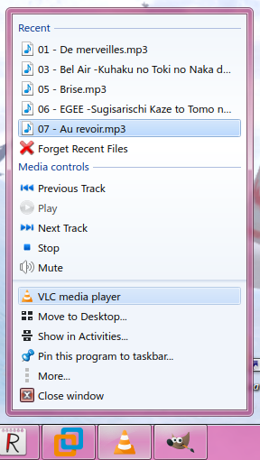
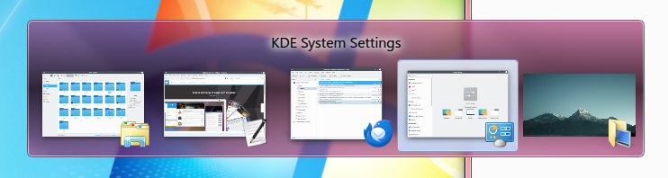
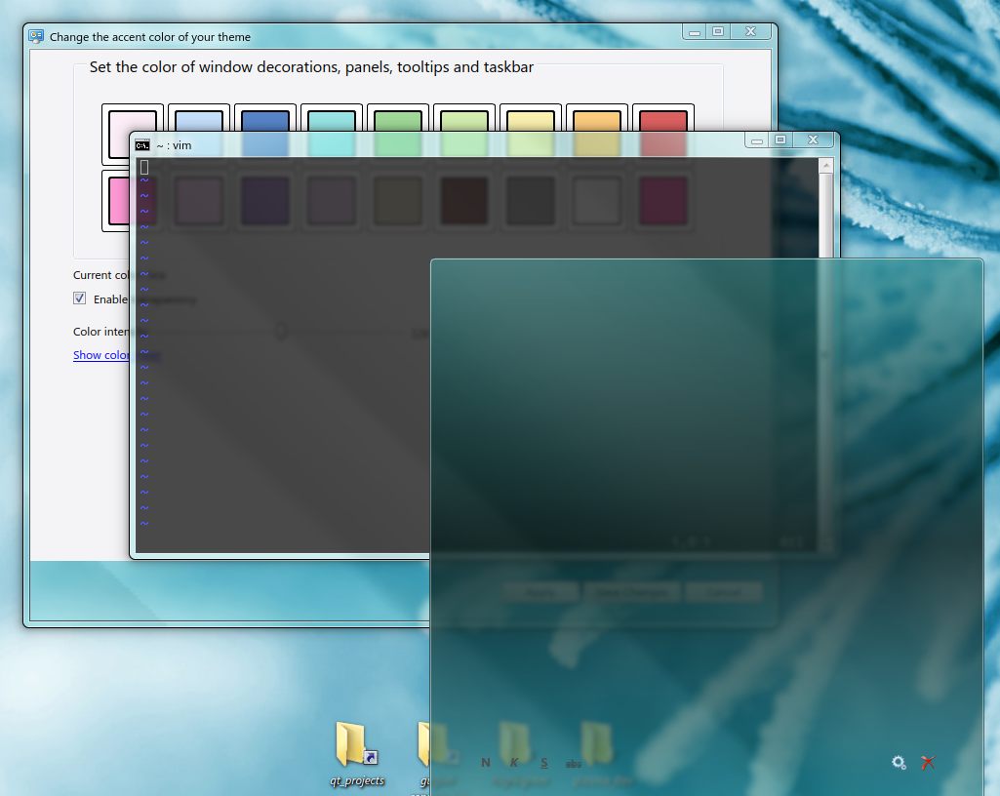

# AERO THEME FOR KDE PLASMA

# WARNING: THIS PROJECT IS NOT ACTIVE
## Due to real life circumstances, I don't have much time to work on this project. This project is developed in my spare time and updated when I feel it is good enough to be updated. In other words, updates are done when they are done.

## Microsoft® Windows™ is a registered trademark of Microsoft® Corporation. This name is used for referential use only, and does not aim to usurp copyrights from Microsoft. Microsoft Ⓒ 2023 All rights reserved. All resources belong to Microsoft Corporation.

## Credits

*See [DOCUMENTATION.md](./DOCUMENTATION.md)*

Buy me a loaf of bread (Monero): 
`45WrFdAJvAaLTPA27xfqckPGiqphTBnbmELxdBrjpkpW7Bwuc9Rn2TT13QXm7eHZgVJKRPDBbJFLt4Crg9EXLxKp9E9AHJp`

## TABLE OF CONTENTS
1. [Introduction](#introduction)  
2. [Screenshots](#screenshots)
3. [Installation](#installation)  
4. [Documentation](#documentation)
5. [FAQ](#questions)

## Introduction 

This is a project which aims to recreate the look and feel of Windows 7 as much as possible on KDE Plasma.
It is still in heavy development and testing. This project has been tested on:

 - Arch Linux (Up to date LTS kernel, 64-bit), Artix (Up to date LTS kernel, 64-bit)
 - X11 
 - Latest stable KDE Plasma release, latest KDE Frameworks version
 - Latest Qt version
 - GTK2
 - Intel integrated graphics, AMD dedicated graphics
 - 96 DPI scaling
  
Here's what's currently not supported but should be (see FAQ):

 - Multi-distro support (While this could work on other distros, I cannot provide help if something goes wrong)
 - HiDPI scaling
 - Multilanguage support

The following will not be supported at all in the foreseeable future:

 - GTK3
 - GTK4
 - Wayland

<h3>DISCLAIMER:</h3>

This project modifies certain system components of KDE Plasma which are not meant to be modified. Reinstalling or updating KDE plasma through the package manager will bring back the original upstream components back, so it's required to redo certain parts of the installation process. **Modifying private system components can leave your desktop environment in a broken state**. Make sure to create backups before attempting to install this project. I am not responsible for broken KDE and/or Linux installs.

Due to the fact that this project is under development and depends on upstream for a lot of things, many things are subject to change and will likely break as KDE Plasma gets updated over time. Keep an eye out on the issue tracker for further details when things inevitably happen to break. 

Lastly, feel free to fork this project and/or contribute to it in any way. Any and all effort is greatly appreciated.

## Screenshots 

### Example Desktop

### Start Menu

### Dolphin

### Context Menu

### Taskbar

### Clock

 

### System Tray

### Icons

### Plasma Style

### Reflections and accent colors

### Window Style

## Installation 

*See [INSTALL.md](./INSTALL.md)*

## Documentation 

*See [DOCUMENTATION.md](./DOCUMENTATION.md)* 

## FAQ 

### What do you mean by support? Can I not use this if I have an unsupported setup?
    
You can still use this project, and it will most likely work, but any errors and bugs caused by the unsupported parts of your setup I most likely cannot debug or fix easily or in a reasonable amount of time, or at all. If it's a simple fix, I don't mind doing it, but anything more is likely out of my scope.

The main factor that decides whether something is supported or not is availability. I either don't have the hardware required to test things (I don't have a HiDPI monitor or a large variety of Nvidia GPUs, for example), or I simply don't and/or can't use certain software (Wayland).

### Is this project designed to help Windows users migrate to Linux?

In short: No.

Ultimately, this project doesn't change the fact that the underlying operating system is still Linux. The goal of this project isn't to act as a full Windows desktop replacement, or to provide any easy way for Windows users to migrate to Linux.

The main goal is to maintain the Aero visual style and keep it as authentic as possible while adapting it for Linux where it's necessary. This project is most likely not for people who want Aero but do not want to deal with Linux. There are many resources online that provide guides on how to bring back Aero into Windows 10 and 11, more or less, for those who aren't willing to migrate over to Linux, and that's totally fine.

### Will there be a Vista variant of this theme?

I'd like to make it, but this project has already gone up too much in scope for one person to handle :)

Still, there's enough demand for it to warrant development, so I don't want to say no, but it's not happening soon. 

### Why do certain details of this theme still look inaccurate and wrong?

A list of possible reasons:

- This is a work in progress, so I simply haven't come down to fixing it.
- The details can be fixed but it's incredibly time consuming and tedious to do so (for example, icons and the Qt widget style). Thus they're low priority on my end. These little wrong details burn my eyes too, don't worry. 
- I have no control over how certain parts of the desktop look like (for example, font rendering, KDE system plasmoids and shortcut/symlink icon placement, and other totally not overly specific things I tried to fix already)
- I simply didn't notice it, so thank you for pointing it out. :)
