# AERO THEME FOR KDE PLASMA

# WARNING: THIS PROJECT IS NOT ACTIVE
## Due to real life circumstances, I don't have much time to work on this project. This project is developed in my spare time and updated when I feel it is good enough to be updated. In other words, updates are done when they are done.

<h2>Microsoft® Windows™ is a registered trademark of Microsoft® Corporation. This name is used for referential use only, and does not aim to usurp copyrights from Microsoft. Microsoft Ⓒ 2016 All rights reserved. All resources belong to Microsoft Corporation.</h2>

## Credits

1. [Aero for Emerald](https://store.kde.org/p/1003826/)
2. [Aero Mouse Cursors with Drop Shadow](https://store.kde.org/p/999972/)
3. [Avalon Menu](https://store.kde.org/p/1386465/)
4. [Digital Clock Lite](https://www.kde-look.org/p/1225135/)
5. [Equilibrium GTK3](https://store.kde.org/p/1493643/)
6. [Expose Air Tweaked](https://store.kde.org/p/1722560/)
7. [MMcK Launcher](https://store.kde.org/p/1720532)
8. [Seven-Black](https://www.kde-look.org/p/998614)
9. [Seven Black Aurorae](https://store.kde.org/p/1002615)
10. [Show Desktop (Win7)](https://www.kde-look.org/p/1100895/)
11. [Smaragd](https://www.pling.com/p/1167274)
12. [VistaVG Ultimate](https://www.deviantart.com/vishal-gupta/art/VistaVG-Ultimate-57715902)
13. [Volatile](https://www.pling.com/p/998823)
14. [Win2-7](https://www.gnome-look.org/p/1012465)
15. [Win2-7(Pixmap)](https://www.opendesktop.org/p/1014539)
16. [Windows 7 GTK3 Theme](https://b00merang.weebly.com/windows-7.html)
17. [Windows 7 Kvantum Theme](https://www.pling.com/p/1679903)
18. [Windows 8 Icon Theme](https://b00merang.weebly.com/icon-themes.html)
    
These are all the projects which I have either mentioned or forked for the purposes of this theme pack. Please consider checking them out and checking out the authors who created these themes, plasmoids and other tweaks.

XMR: `45WrFdAJvAaLTPA27xfqckPGiqphTBnbmELxdBrjpkpW7Bwuc9Rn2TT13QXm7eHZgVJKRPDBbJFLt4Crg9EXLxKp9E9AHJp`

## TABLE OF CONTENTS
1. [Introduction](#introduction)  
2. [Screenshots](#screenshots)
3. [List of components and changes](#list-of-components)
4. [Installation](#installation)  
5. [Documentation](#documentation)
6. [TODO List](#todo-list)

## Introduction 

This is a project which aims to recreate the look and feel of Windows 7 as much as possible on KDE Plasma.
It is still in early development and testing. Currently supported platforms, features and specifications are:

 - Arch Linux (Up to date LTS kernel, 64-bit), Artix (Up to date LTS kernel, 64-bit)
 - X11 
 - Latest stable KDE Plasma release, latest KDE Frameworks version
 - Latest Qt version
 - GTK2
 - Intel integrated Graphics, AMD GPUs
 - 96 DPI scaling
  
Features that are currently not supported but should be:

 - Multi-distro support (While this could work on other distros, I cannot provide help if something goes wrong)
 - Nvidia GPU support
 - HiDPi scaling
 - Multilanguage support

The following will not be supported at all:

 - GTK3
 - GTK4
 - Wayland

<h3>DISCLAIMER:</h3>

Certain plasmoids featured here make use of non-standard SVG items that are only available on this theme pack. Because of this, it is not recommended to use them outside of this theme.  More on this is written in the documentation file, which lists the technical details.

Also, this project modifies certain system components of KDE Plasma which are not meant to be editable, and WILL be replaced if KDE Plasma is reinstalled or upgraded. **Modifying private system components can leave your desktop environment in a broken state**. Make sure to create backups before attempting to install this project. I am not responsible for broken KDE and/or Linux installs.

Due to the fact that this project is under development and depends on upstream for a lot of things, things are subject to change and will likely break with updates from KDE and other components of the Linux desktop. As such, they may affect components of this theme. Keep an eye out on the issue tracker for further details when things inevitably happen to break. 

Feel free to take this theme pack and modify it for yourself or share it with others, and if 
there are any improvements to be made here, any and all effort would be greatly appreciated.

## Screenshots 

### Example Desktop

### Start Menu

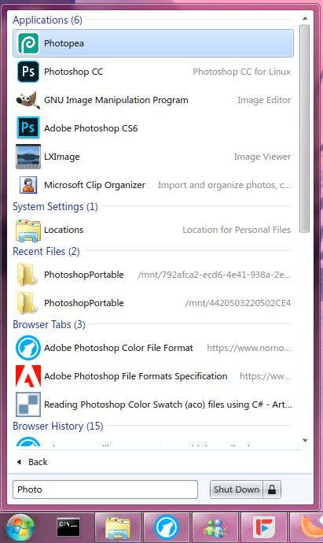

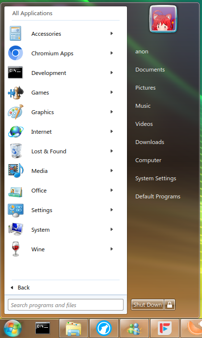
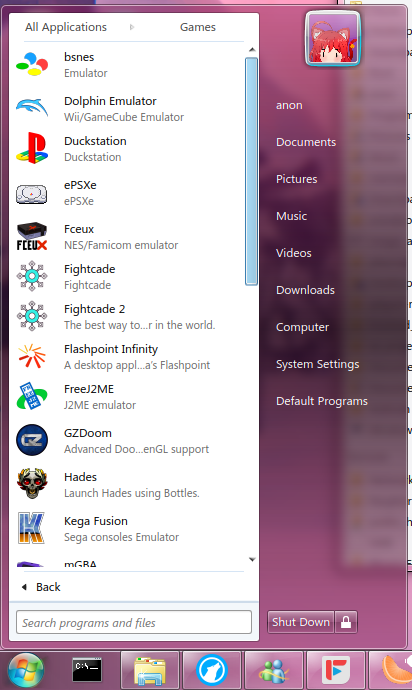

### Dolphin
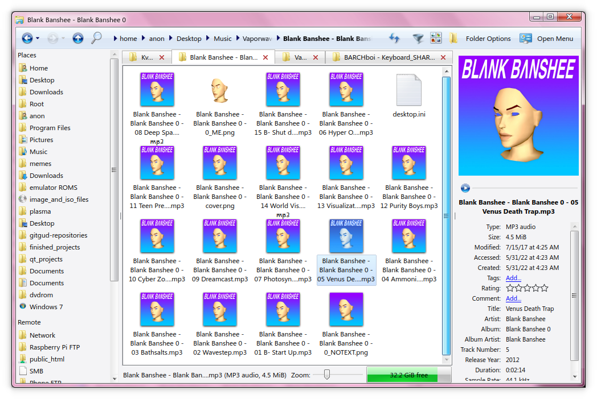

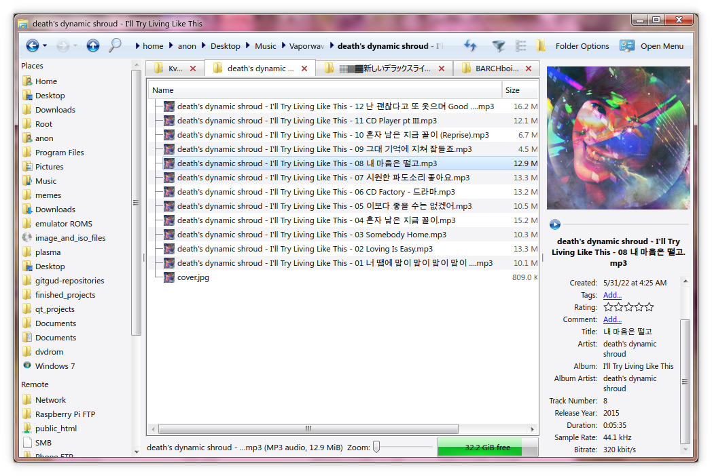

### Context Menu

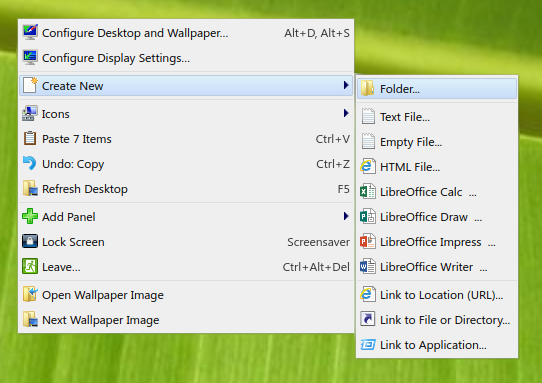
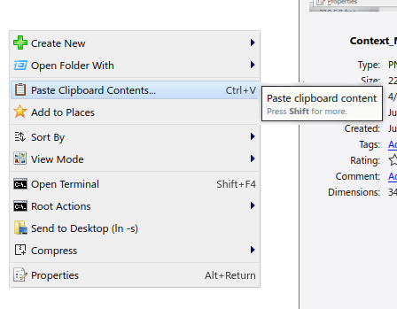

### Taskbar

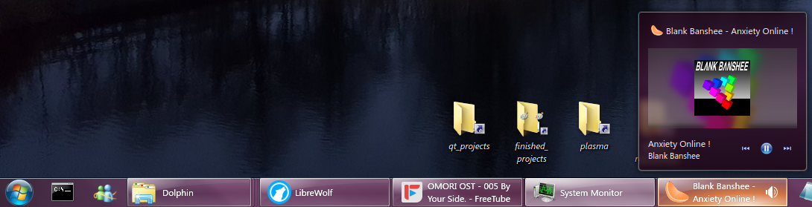

### Clock

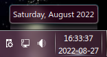 
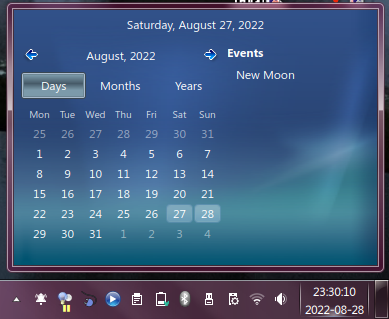

### System Tray

### Icons

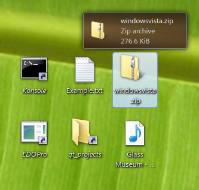

### Plasma Style

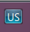

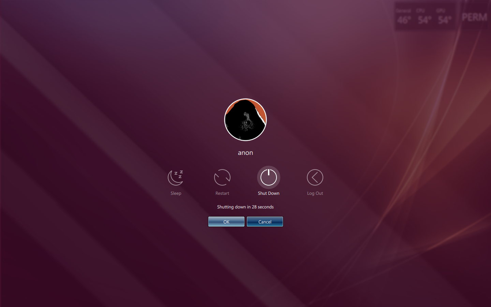

### AeroColorMixer

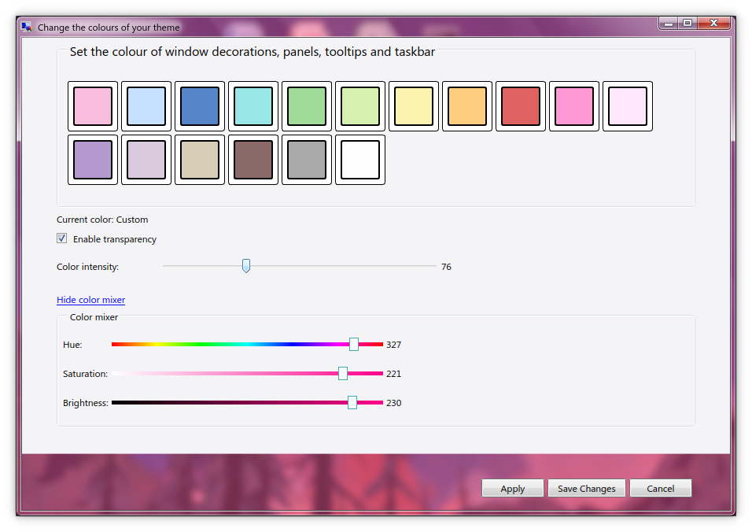

### Window Style

## List of components and changes 

*Full changelog can be read at [CHANGELOG.md](./CHANGELOG.md) of this repository.*

The full scope of this project has become bigger than I had initially expected when I started working on it. Having a comprehensive list of components that have been added to the project, as well as a list of planned components, is something that needed to be fleshed out a long time ago. This is a list of components that are included in this project, as well as their feature completion status (Note: finished components are still subject to bugs, general enhancements and maintenance, but they are more or less feature complete.)

### Plasmoids

User plasmoids:

- **DigitalClockLite Seven**: A clock and calendar plasmoid based on DigitalClockLite, with aesthetic changes. Originally written by INTIKA. [Finshed]
- **SevenStart**: An application launcher based on the Start Menu from Windows 7. Fork of Avalon Menu, written by ADHE. [Unfinished]
- **SevenTasks**: Task manager based on Windows 7's taskbar. [Unfinished]
- **Show Desktop (Win 7)**: Fork of the plasmoid with the same name written by Zren. Purely visual changes were done to the plasmoid. [Finished] 

System plasmoids and modifications:

- **DefaultToolTip.qml**: Edited QML component used for displaying tooltips, now with less padding and smaller font sizes. [Finished]
- **Desktop shell**: Reduced padding and fixed hover selections. [Finished]
- **Keyboard layout switcher**: Smaller, better aligned text with a button for better visuals. [Finished]
- **System tray**: Major redesign and different placement, with more aesthetic differences than functional ones. [Finished]

### Themes

- **Aero Cursors**: Created by MOONY. [Unfinished]
- **SevenBlack**: Heavily edited fork of the Plasma theme with the same name by MIRKOGENNARI. [Unfinished]
- **Sound collection**: Sound effects used in Windows 7. [Finished]
- **Win2-7**: Fork of a GTK2 theme written by JUANDEJESUSS. Adapted to work better with QGtkStyle. [Finished]
- **Windows 7 Kvantum**: Fork of a Kvantum theme written by DRGORDBORD. [Finished]
- **WindowsIcons**: Fork of the Windows 8 icon pack created by the B00merang team. Adapted to fit KDE better, importing Windows 7 icons. [Unfinished]

### KWin

- **Smaragd Seven**: Fork of Smaragd, an implementation of Emerald for KWin. Fixes some bugs and fixes the text glow effect. Used in conjunction with a fork of an Emerald theme written by nicu96. [Unfinished]

### Utility programs

- **AeroColorMixer**: Program designed for changing colours within this project. [Finished]

### Components yet to be implemented

These components are listed from highest priority to lowest priority.

- **Qt visual style based on reading Msstyle themes (Like QWindowsVistaStyle)**
- **KWin effect for Window reflections**
- **KWin task switcher**
- **SDDM Login theme and lock screen**
- **Plymouth theme(?)**

## Installation 

*See [INSTALL.md](./INSTALL.md)*

## Documentation 

*See DOCUMENTATION.md (Coming soon)* 

## TODO List 

1. Improve the Seven Start menu plasmoid
    1. If possible, make the sidebar entries configurable
    2. Make the top-right icon stick out of the Start menu 
    3. If possible, make the top-right icon change depending on which sidebar is hovered over and more accurate theming
	5. Add a sidebar feature which includes recent items and actions for each application
2. Improve the icon theme
3. Rework the SevenTasks context menu
4. Add vertical taskbar support
5. Add more theme-specific documentation and KDE/QML documentation.

    
